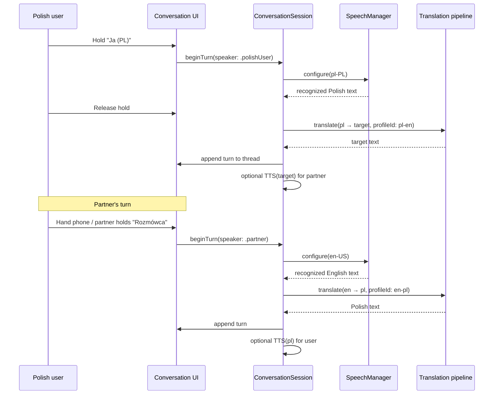

# TalkRescue 1.3 — Conversation Mode Design

**Date:** June 2026  
**Status:** Planning only — **no implementation**  
**Prerequisite:** v1.2 Supabase proxy, v1.2.1 profiles (`pl-en`, `pl-sv`, `pl-es`, `pl-de`)  
**Related:** [`APPLE_TRANSLATION_V1_3.md`](APPLE_TRANSLATION_V1_3.md), [`LANGUAGE_UX_V1_2.md`](LANGUAGE_UX_V1_2.md)

---

## Executive summary

TalkRescue today is **single-direction**: the Polish speaker holds the phone, speaks Polish, and receives a target-language line for the other person. Conversation Mode adds **bidirectional turns** so both people can speak naturally in their own language.

**Recommended production MVP:** **Option A — dual push-to-talk** with a **lightweight split transcript** (borrowed from Option C). The user explicitly taps who is speaking; no automatic speaker detection in v1.3.

| Dimension | Assessment |
|-----------|------------|
| Migration complexity | **Medium–high** — new session model, bidirectional speech + translation |
| UI impact | **New mode** (tab or entry) — existing Main + Rescue unchanged |
| Rescue Mode | **Unchanged** — stays single-direction emergency path |
| Estimated effort | **~12–18 developer days** (MVP) |

---

## 1. Problem statement

### Current flow (v1.2)

```
Polish user speaks → pl-PL speech recognition → translate → target text (+ optional TTS)
```

The foreign speaker has **no in-app path** to reply. The Polish user must manually flip roles: read the partner's words, mentally translate, or hand the phone back and forth without structured reverse translation.

### Target flow (Conversation Mode)

```
Turn 1: Polish user  → PL speech → translate → target text → TTS/read for partner
Turn 2: Foreign user → target speech → translate → Polish text → TTS/read for user
Turn 3: …
```

**Goal:** Feel like a simple interpreter sitting between two people, not a one-way phrase tool.

---

## 2. Personas and usage contexts

| Persona | Role | Needs |
|---------|------|-------|
| **Primary user** | Polish speaker abroad | Speak Polish; hear/read Polish when partner replies |
| **Partner** | Local (EN/DE/SV/ES) | Speak their language; see/hear translation |
| **Stress context** | Noisy café, clinic, hotel | Clear turn ownership; minimal mis-taps |
| **AirPods user** | Hands-free preference | Hear Polish in ear; partner hears phone speaker |

TalkRescue's brand promise (**Rescue**) stays optimized for panic; Conversation Mode targets **calmer two-way dialogue** (hotel check-in, neighbor chat, coworker exchange).

---

## 3. UX options compared

### Option A — Push-to-talk: Side A / Side B

Two large buttons: **Ja (polski)** and **Rozmówca (niemiecki/…)**. Hold the button for the active speaker; release to translate.

| Pros | Cons |
|------|------|
| Explicit turn ownership — works in noise | Requires teaching partner the pattern |
| Reuses proven hold-to-speak muscle memory | Two-handed when switching often |
| Lowest false-trigger rate | Partner must reach the phone or user holds it |
| Minimal battery vs always-on | Slightly slower than auto-detect |
| Maps cleanly to locale-specific speech recognizers | |

**Best for:** MVP, noisy environments, stressed users.

---

### Option B — Automatic speaker switching

Continuous or VAD-gated listening; system detects who spoke (language ID or voice profile).

| Pros | Cons |
|------|------|
| Feels magical when it works | **High mis-detection** in noise, overlap, similar accents |
| Hands-free alternating turns | Requires locale inference Apple doesn't expose reliably on-device |
| | Switching `SFSpeechRecognizer` locale mid-session adds **300–800 ms** latency |
| | Battery drain from always-on mic |
| | Partner speech may be misrecognized as Polish or vice versa |
| | Hard to debug user complaints |

**Best for:** v1.4+ research spike only — **not production MVP**.

---

### Option C — Split-screen conversation

Screen divided: top = **Ty** (Polish thread), bottom = **Rozmówca** (target thread). Each side has its own mic affordance or shared control.

| Pros | Cons |
|------|------|
| Clear visual separation of threads | Cramped on iPhone SE |
| Natural chat metaphor | Still needs A or B for *who* is recording |
| Scales to turn history | More UI complexity |
| Partner can read their side upside-down if phone centered | |

**Best for:** Transcript presentation — **combine with Option A** for MVP (split view + dual buttons).

---

### Comparison matrix

| Criterion | A: Dual PTT | B: Auto switch | C: Split screen |
|-----------|-------------|----------------|-----------------|
| Noisy environment | ★★★★★ | ★★ | ★★★★ |
| Battery | ★★★★ | ★★ | ★★★★ |
| Latency predictability | ★★★★★ | ★★★ | ★★★★ |
| Implementation risk | ★★★★ | ★★ | ★★★ |
| Partner clarity | ★★★★ | ★★★ | ★★★★★ |
| Rescue compatibility | ★★★★★ | ★★★ | ★★★ |

---

## 4. Recommended production MVP

**Hybrid: Option A + Option C (transcript only)**

- **Entry:** New **Rozmowa** tab (5th tab) or prominent card on Main — *not* Action Button in v1.3.
- **Layout:** Vertical chat thread (newest at bottom) + **two fixed hold buttons** at bottom.
- **Buttons:**
  - Left: **Ja · Polski** (blue/accent)
  - Right: **Rozmówca · {shortLabel}** (neutral/contrast)
- **No auto speaker detection** in v1.3.
- **Rescue Mode:** Unchanged — single-direction `pl → target` for emergencies.

### Why this wins

1. Matches existing `requestBeginRecording` / hold-release pattern in `RescueSession`.
2. Survives cafés, streets, clinics — user overrides ambiguity.
3. Split transcript gives conversation context without requiring full-screen dual panes.
4. Defers hardest engineering (locale auto-detect, dual always-on pipelines).
5. Rescue / Action Button stay fast and simple — no regression risk.

---

## 5. Screen layout (MVP wireframe)

```
┌─────────────────────────────────────────┐
│  Rozmowa          [Angielski ▾]    ⚡   │  ← chip + Rescue shortcut
├─────────────────────────────────────────┤
│  ┌─────────────────────────────────┐   │
│  │  Scroll: conversation thread     │   │
│  │                                  │   │
│  │  [Rozmówca] Can I help you?      │   │  ← target bubble (left)
│  │         Nie, dziękuję.           │   │  ← PL bubble (right) small
│  │                                  │   │
│  │  [Ty] Potrzebuję pokój.          │   │  ← PL source (right)
│  │       I need a room.             │   │  ← target translation (left)
│  │                                  │   │
│  │  … status: „Słucham rozmówcy…”   │   │
│  └─────────────────────────────────┘   │
│                                         │
│  Toggle: Czytaj tłumaczenie na głos     │
│  Toggle: Kieruj dźwięk na głośnik       │  ← AirPods routing hint
│                                         │
│  ┌──────────────┐  ┌──────────────┐    │
│  │  JA          │  │  ROZMÓWCA    │    │
│  │  🇵🇱 Przytrzymaj│  │  🇬🇧 Przytrzymaj│    │
│  └──────────────┘  └──────────────┘    │
└─────────────────────────────────────────┘
```

### Bubble rules

| Speaker | Source bubble | Translation bubble |
|---------|---------------|-------------------|
| Polish user (Ja) | Polish text, right-aligned | Target text, left-aligned (for partner) |
| Partner (Rozmówca) | Target text, left-aligned | Polish text, right-aligned (for user) |

Only the **translation** line triggers TTS when Auto Speak is on (configurable per side in v1.3.1).

---

## 6. Language selection

### Conversation pair (new model)

Extends today's `LanguageProfile` with a **reverse direction**:

| Forward (existing) | Reverse (new) | Example |
|--------------------|---------------|---------|
| `pl-en` | `en-pl` | PL→EN and EN→PL |
| `pl-de` | `de-pl` | PL→DE and DE→PL |
| `pl-sv` | `sv-pl` | PL→SV and SV→PL |
| `pl-es` | `es-pl` | PL→ES and ES→PL |

**UI:** Reuse `LanguageChipControl` — one chip selects the **partner language**; both directions derive from it.

**Onboarding:** Optional one-line addition: *"W trybie rozmowy obie strony mówią po swojemu."* — not blocking.

### Speech locales

| Side | `SFSpeechRecognizer` locale | Notes |
|------|----------------------------|-------|
| Ja | `pl-PL` (unchanged) | Existing `SpeechManager` path |
| Rozmówca | `en-US`, `de-DE`, `sv-SE`, `es-ES` | **New** — per-profile `targetLocaleIdentifier` |

**Recognizer switching:** One active recognizer at a time; swap locale when user presses the corresponding button (no parallel capture).

---

## 7. Speech flow



### Turn state machine

```
idle
  → recording (ja | rozmówca)
  → finalizing
  → translating
  → displaying (+ optional TTS)
  → idle
```

**Guards (reuse from `RescueSession`):**

- `translationGeneration` — cancel stale translations on new turn
- One recording context at a time
- No overlap between Ja and Rozmówca buttons

---

## 8. TTS flow

| Turn | Auto Speak ON | Default audio route |
|------|---------------|---------------------|
| Ja spoke → target translation | Speak **target** language | **Speaker** (partner hears) |
| Rozmówca spoke → Polish translation | Speak **Polish** | **Current route** (AirPods if connected) |

### Toggles (MVP)

| Setting | Default | Purpose |
|---------|---------|---------|
| Czytaj tłumaczenie | Off | Master Auto Speak |
| Głośnik dla rozmówcy | On when no AirPods | Force speaker when Ja turn completes |

**Implementation note:** Reuse `TTSService` — call `prepare(voiceLanguage:)` per turn direction. `releasePlaybackForRecording()` before next capture (existing pattern).

### AirPods behavior

| Scenario | Recommended MVP behavior |
|----------|--------------------------|
| User wears AirPods, Ja turn | TTS target → **phone speaker** (so partner hears); haptic + large target text |
| User wears AirPods, Rozmówca turn | TTS Polish → **AirPods** (user hears translation privately) |
| No AirPods | TTS plays on speaker both ways; user passes phone |
| User overrides | "Głośnik dla rozmówcy" toggle forces `.defaultToSpeaker` on partner-facing TTS |

**Risk:** Partner may not hear TTS if user keeps AirPods and forgets speaker toggle — mitigate with first-run tooltip and visible 🔊 icon on Ja turns.

**Recording with AirPods:** Keep `allowBluetoothHFP` in `SpeechManager` — Rozmówca can speak into AirPods mic if user hands earbud (edge case; document as unsupported in v1.3).

---

## 9. Rescue Mode interaction

| Rule | Rationale |
|------|-----------|
| Rescue Mode **does not** enter Conversation Mode | Emergency path stays one-tap, one-direction |
| Action Button → **Rescue only** (v1.3) | No new cold-launch complexity |
| Conversation tab offers **⚡ Rescue** toolbar button | Escape hatch if conversation fails |
| Conversation state **not** persisted across Rescue | Avoid mic/session conflicts |
| Returning from Rescue → last conversation thread restored | `ConversationStore` snapshot |

**Shared infrastructure:** `SpeechManager`, `TranslationService`, `RescuePhraseCache` (forward only), `TTSService` — but **separate orchestrator** (`ConversationSession`) to avoid breaking `RescueSession`.

---

## 10. Architecture

### High-level

```
┌─────────────────────────────────────────────────────────────────┐
│                        TalkRescue 1.3                            │
├─────────────────────────────────────────────────────────────────┤
│  Main (existing)     │  Conversation (NEW)  │  Rescue (same) │
│  single-direction    │  bidirectional turns   │  emergency     │
├─────────────────────────────────────────────────────────────────┤
│  RescueSession       │  ConversationSession   │  RescueSession │
│  SpeechManager       │  SpeechManager (shared)│  (shared)      │
│  TranslationService  │  + reverse profiles    │                │
│  RescuePhraseCache   │  ConversationStore     │                │
│  TTSService          │  TTSService (shared)   │                │
└─────────────────────────────────────────────────────────────────┘
                              │
                              ▼
                    Supabase translate (pl-X, X-pl)
                    Apple Translation (future, both directions)
```

### New components (implementation sprint)

| Component | Role |
|-----------|------|
| `ConversationPair` | Forward + reverse profile IDs, speech locales |
| `ConversationTurn` | `speaker`, `sourceText`, `translatedText`, `timestamp` |
| `ConversationSession` | Turn state machine, thread management |
| `ConversationStore` | Persist thread (session-scoped or 24h) |
| `ConversationView` | Thread + dual PTT buttons |
| Reverse `profileId`s | `en-pl`, `de-pl`, `sv-pl`, `es-pl` on Edge Function |

### Translation pipeline per turn

```
1. RescuePhraseCache (forward only today — extend with reverse cache later)
2. Apple Translation (iOS 18+, when [`APPLE_TRANSLATION_V1_3.md`](APPLE_TRANSLATION_V1_3.md) ships)
3. Supabase proxy (profileId = pl-en OR en-pl)
```

### Backend contract extension

```json
// Forward (existing)
{ "text": "nie rozumiem", "profileId": "pl-de" }

// Reverse (new)
{ "text": "I don't understand", "profileId": "en-pl" }
```

Server prompt style unchanged: one natural spoken sentence, conversational, no quotes.

---

## 11. Apple Translation future integration

| Direction | Apple Translation pair | Fallback |
|-----------|------------------------|----------|
| PL → EN | `pl` → `en` | `pl-en` proxy |
| EN → PL | `en` → `pl` | `en-pl` proxy |
| PL → DE | `pl` → `de` | `pl-de` proxy |
| DE → PL | `de` → `pl` | `de-pl` proxy |

**Conversation Mode benefits most from Apple Translation:**

- **2× turns** per exchange → 2× network calls today; local path cuts latency and cost dramatically.
- Bidirectional offline (models installed) enables **airplane-mode conversation** — strong marketing story.

**Constraints carry over:**

- No download UI on turn start — check `.installed` before local path.
- Reverse pairs need separate availability checks (`en` → `pl` may differ from `pl` → `en`).

**Phase alignment:** Ship Conversation MVP on proxy first; layer Apple Translation from `APPLE_TRANSLATION_V1_3` into `ConversationSession` without UI changes.

---

## 12. Noisy environments

| Challenge | MVP mitigation |
|-----------|----------------|
| Background chatter | Explicit PTT — only active side records |
| Partner speaks while user holds Ja button | Visual recording indicator; release cancels |
| STT garbage | Reuse `isUsableTranscript` minimum letter check |
| User unsure who spoke | Thread shows last speaker label prominently |
| Cafe music | Recommend speaker-facing TTS + large text for partner |

**Deferred:** Noise suppression tuning, external mic, Apple `AVAudioSession` mode experiments.

---

## 13. Battery and latency

### Battery

| Mode | Relative drain |
|------|------------------|
| Current Main (PTT) | Baseline |
| Conversation PTT | ~1.1× — occasional recognizer locale swap |
| Auto speaker (Option B) | ~2–3× — rejected for MVP |

**Mitigations:** Stop engine between turns (existing `SpeechManager` behavior); no background listening.

### Latency budget (per turn, cache miss)

| Stage | Forward (today) | Conversation add |
|-------|-----------------|------------------|
| Hold release → STT finalize | 100–400 ms | Same |
| Locale swap (partner turn) | — | **+200–500 ms** (first turn after switch) |
| Translation (proxy) | 800–2500 ms | Same per direction |
| Translation (Apple, future) | — | 50–300 ms |
| TTS start | 100–300 ms | Same |

**User-perceived round-trip:** Two turns ≈ 2× single-direction latency unless Apple Translation reduces both legs.

---

## 14. Risks

| Risk | Severity | Mitigation |
|------|----------|------------|
| Reverse STT quality poor for DE/SV/ES | **High** | Device QA matrix; show editable transcript before translate (v1.3.1) |
| Partner confused by dual buttons | **Medium** | Polish labels + icons; animate active side |
| Mic/session conflict Rescue ↔ Conversation | **High** | Separate `ConversationSession`; mutual `cancelActiveWork()` |
| 2× API cost per exchange | **Medium** | Apple Translation path; turn-level cache |
| iPhone SE layout cramped | **Medium** | Scroll thread; compact buttons |
| AirPods routing wrong | **Medium** | Speaker override for partner-facing TTS |
| Reverse prompts quality | **Medium** | Server-owned prompts per `en-pl`, etc. |
| Scope creep into auto-detect | **Medium** | Explicit MVP scope lock |

---

## 15. Implementation phases

### Phase 0 — Design validation (2–3 days)

- [ ] Paper prototype with 3 users (PTT vs auto preference)
- [ ] Test `SFSpeechRecognizer` for `de-DE`, `en-US` on device — WER on short phrases
- [ ] Confirm Edge Function reverse `profileId` prompts

### Phase 1 — Backend (2–3 days)

- [ ] Add `en-pl`, `de-pl`, `sv-pl`, `es-pl` to `prompts.ts` + validation
- [ ] Deploy `translate` function
- [ ] curl both directions for each pair

### Phase 2 — Core session (4–5 days)

- [ ] `ConversationPair`, `ConversationTurn`, `ConversationSession`
- [ ] Locale-switching in `SpeechManager` (or thin wrapper)
- [ ] Turn state machine + thread store
- [ ] Unit-free; device tests only

### Phase 3 — UI (3–4 days)

- [ ] `ConversationView` — thread + dual PTT
- [ ] New tab or Main entry card
- [ ] Language chip integration
- [ ] TTS routing toggles

### Phase 4 — Integration polish (2–3 days)

- [ ] Rescue toolbar escape
- [ ] AirPods speaker override
- [ ] Error UX (Polish strings)
- [ ] Empty / retry states

### Phase 5 — TestFlight (1–2 weeks)

- [ ] Noisy environment soak
- [ ] All four partner languages
- [ ] Rescue regression suite
- [ ] API usage monitoring (2× turns)

### Phase 6 — Apple Translation (optional, post-MVP)

- [ ] Wire `AppleTranslationService` into `ConversationSession` per direction
- [ ] See [`APPLE_TRANSLATION_V1_3.md`](APPLE_TRANSLATION_V1_3.md)

---

## 16. Estimated effort

| Phase | Days | Cumulative |
|-------|------|------------|
| Phase 0 — validation | 2–3 | 3 |
| Phase 1 — backend | 2–3 | 6 |
| Phase 2 — session | 4–5 | 11 |
| Phase 3 — UI | 3–4 | 15 |
| Phase 4 — polish | 2–3 | 18 |
| Phase 5 — TestFlight | 5–10 (calendar) | ship |
| **MVP total (engineering)** | **~12–18 days** | |

Does not include Apple Translation (add 3–5 days) or Option B auto-detect research (add 5–8 days, uncertain outcome).

---

## 17. Manual test checklist (post-implementation)

| # | Test | Expected |
|---|------|----------|
| 1 | Ja hold → Polish → release | Target bubble + optional speaker TTS |
| 2 | Rozmówca hold → English → release | Polish bubble + AirPods TTS if connected |
| 3 | Alternate 5 turns | Thread order correct |
| 4 | Switch chip DE → EN mid-session | Next Rozmówca turn uses `de-DE` then `en-US` |
| 5 | Noisy café | PTT avoids cross-talk (subjective) |
| 6 | Rescue from Conversation | Rescue works; return restores thread |
| 7 | Action Button | Still launches Rescue only |
| 8 | Cache phrase forward | `nie rozumiem` instant on Ja turn |
| 9 | Retry failed turn | Re-translates same source text |
| 10 | Airplane mode (future Apple path) | Both directions offline when models installed |

---

## 18. Open questions

1. **Tab vs Main card entry** — 5th tab adds complexity; card keeps tab bar clean. *Lean: 5th tab "Rozmowa" for discoverability.*
2. **Persist conversation threads?** — Session-only vs 24h history. *Lean: session-only MVP; optional save last thread.*
3. **Partner-facing UI language** — Keep Polish chrome only, or show partner hint in target language? *Lean: Polish UI + target language on Rozmówca button only.*
4. **Edit transcript before translate?** — Helps STT errors; adds tap. *Defer to v1.3.1.*
5. **Raise deployment target?** — Not required for Conversation; Apple Translation still gated iOS 18.

---

## 19. Decision summary

| Decision | Choice |
|----------|--------|
| MVP UX | **Dual push-to-talk + chat thread** |
| Auto speaker switching | **Not in v1.3** |
| Split-screen | **Thread bubbles only** (not dual full panes) |
| Rescue Mode | **Unchanged** |
| Action Button | **Rescue only** |
| Partner languages | EN, DE, SV, ES (matching v1.2.1) |
| Backend | Reverse `profileId`s on existing Edge Function |
| Apple Translation | **Phase 6** after proxy MVP |

---

## 20. References

- [`docs/LANGUAGE_UX_V1_2.md`](LANGUAGE_UX_V1_2.md) — chip, onboarding
- [`docs/IOS_SUPABASE_TRANSLATION_V1_2.md`](IOS_SUPABASE_TRANSLATION_V1_2.md) — proxy contract
- [`docs/APPLE_TRANSLATION_V1_3.md`](APPLE_TRANSLATION_V1_3.md) — on-device path
- [`docs/LOCAL_TRANSLATION_ROADMAP.md`](LOCAL_TRANSLATION_ROADMAP.md) — early local translation notes
- Apple: [Translating text within your app](https://developer.apple.com/documentation/translation/translating-text-within-your-app)

---

*TalkRescue 1.3 Conversation Mode — planning document. No Swift or UI implementation.*
