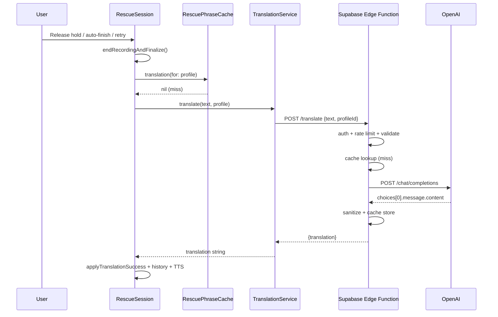

# TalkRescue 1.2A — Secure Translation Architecture

**Date:** June 2026  
**Scope:** Migration from direct OpenAI calls to Supabase Edge Function proxy  
**Status:** Design / audit only — **no code changes in this phase**  
**Prerequisite audits:** `docs/SECURITY_AUDIT.md`, `docs/PRODUCTION_HARDENING_PLAN.md`, `docs/BILLING_RISK.md`

---

## Executive summary

TalkRescue today ships an OpenAI API key inside every customer binary and calls `api.openai.com` directly from the iPhone. This is the primary blocker for safe public App Store launch.

**Minimal migration (v1.2A):** Replace the transport layer in `TranslationService.swift` so the app calls a Supabase Edge Function. The Edge Function holds `OPENAI_API_KEY` as a server secret, applies rate limits and input validation, and forwards to OpenAI. **No UI changes.** `RescueSession`, views, speech, TTS, and local cache stay unchanged.

| Metric | Assessment |
|--------|------------|
| Migration complexity | **Low–medium** — one Swift service file + new Edge Function |
| Estimated effort | **1–2 developer days** (backend + iOS + soak test) |
| UI impact | **None** |
| Risk reduction | **High** — removes billable key from IPA |

---

## 1. Current architecture

```
┌──────────────────────────────────────────────────────────────────────────┐
│                         iPhone (TalkRescue 1.2)                          │
├──────────────────────────────────────────────────────────────────────────┤
│  Microphone ──► Apple Speech (on-device, pl-PL)                          │
│       │              SpeechManager / SFSpeechRecognizer                  │
│       ▼                                                                  │
│  Recognized Polish text                                                  │
│       │                                                                  │
│       ├──► RescuePhraseCache (exact match, per profile namespace)        │
│       │         hit  ──► UI + optional TTS (no network)                  │
│       │         miss ──────────────────────────────┐                     │
│       │                                            ▼                     │
│       └──► RescueSession.translateRecognizedSpeech │                     │
│              └──► TranslationService.translate() │                     │
│                     POST https://api.openai.com/v1/chat/completions      │
│                     Authorization: Bearer <OPENAI_API_KEY from plist>    │
│                     model: gpt-4o-mini, temperature: 0, max_tokens: 64   │
│                     system: profile.openAISystemPrompt                     │
│                     user: recognized Polish text                           │
│       ▼                                                                  │
│  Target-language text ──► UI, UserDefaults history (max 10), TTS       │
│       └──► AVSpeechSynthesizer (on-device, profile.ttsVoiceLanguage)     │
└──────────────────────────────────────────────────────────────────────────┘

External services:
  • Apple — Speech, microphone, TTS
  • OpenAI — Chat Completions API (direct from device)

NOT used:
  • Supabase (no project or client in repo)
  • Custom backend / Edge Functions
  • Apple Translation framework
```

### API key injection path (build → runtime)

| Step | Location | Role |
|------|----------|------|
| 1 | `TalkRescue/Config/Secrets.xcconfig` | Developer sets key (gitignored) |
| 2 | `TalkRescue/Config/Config.xcconfig` | `#include? "Secrets.xcconfig"` |
| 3 | `TalkRescue/Info.plist` | `OPENAI_API_KEY` = `$(OPENAI_API_KEY)` at build time |
| 4 | `TranslationService.swift` | `Bundle.main.object(forInfoDictionaryKey: "OPENAI_API_KEY")` |
| 5 | Every translation | `Authorization: Bearer <key>` sent from device |

**Security implication:** Anyone with the IPA can extract the key via `strings`, `plutil`, or static analysis. The key grants direct OpenAI billing access with no server-side throttle.

### Supported language profiles (v1.2)

All profiles share Polish speech input (`pl-PL`) and differ only in target language, TTS voice, cache namespace, and OpenAI system prompt.

| Profile ID | Target | Cache entries | System prompt owner |
|------------|--------|---------------|---------------------|
| `pl-en` | English (US) | ~20 phrases | `LanguageProfile.openAISystemPrompt` |
| `pl-sv` | Swedish | ~7 phrases | same |
| `pl-es` | Spanish (Spain) | ~7 phrases | same |

Prompts instruct natural spoken output: one short conversational sentence, friendly tone, no quotes.

---

## 2. Target architecture

```
┌──────────────────────────────────────────────────────────────────────────┐
│                         iPhone (TalkRescue 1.2A+)                        │
├──────────────────────────────────────────────────────────────────────────┤
│  Microphone ──► Apple Speech (unchanged)                                 │
│       ▼                                                                  │
│  Recognized Polish text                                                  │
│       ├──► RescuePhraseCache (unchanged — local, synchronous)            │
│       │         miss ──────────────────────────────┐                     │
│       └──► RescueSession (unchanged orchestration) │                     │
│              └──► TranslationService (MODIFIED)    │                     │
│                     POST https://<project>.supabase.co/functions/v1/translate
│                     apikey: <TALKRESCUE_API_KEY>  (app proxy key)          │
│                     X-Device-ID: <Keychain UUID>  (optional, recommended)
│                     Body: { "text": "...", "profileId": "pl-en" }        │
│       ▼                                                                  │
│  Target-language text ──► UI, history, TTS (unchanged)                   │
└──────────────────────────────────────────────────────────────────────────┘
                                    │
                                    ▼
┌──────────────────────────────────────────────────────────────────────────┐
│              Supabase Edge Function: translate                           │
├──────────────────────────────────────────────────────────────────────────┤
│  1. Validate apikey header (TALKRESCUE_API_KEY secret)                   │
│  2. Parse + validate body (text length, profileId allowlist)             │
│  3. Rate limit (IP + optional device ID)                                 │
│  4. Server-side cache lookup (normalized text + profileId)               │
│  5. Map profileId → system prompt (server-owned, not client)             │
│  6. POST OpenAI Chat Completions (OPENAI_API_KEY from Deno.env)         │
│  7. Sanitize one-line output; cache result; return JSON                  │
└──────────────────────────────────────────────────────────────────────────┘
                                    │
                                    ▼
                          OpenAI gpt-4o-mini
                          (key ONLY on server)
```

### What moves off-device

| Asset | Today | Target |
|-------|-------|--------|
| `OPENAI_API_KEY` | In IPA `Info.plist` | Supabase secret (`OPENAI_API_KEY`) |
| System prompts | `LanguageProfile.swift` | Edge Function prompt map (client sends `profileId` only) |
| Rate limits | None | Edge Function |
| Input length cap | None | Edge Function (and optional client cap) |

### What stays on-device

| Component | Reason |
|-----------|--------|
| `RescueSession` | Orchestration unchanged |
| `RescuePhraseCache` | Zero-latency hits; reduces API volume |
| `SpeechManager` | Apple Speech stays local |
| `TTSService` | On-device playback |
| All SwiftUI views | No UX changes in v1.2A |
| `LanguageProfile` (display/TTS/cache) | Still needed for UI; `openAISystemPrompt` becomes dead weight until cleanup sprint |

### What is removed from Release builds

- `OPENAI_API_KEY` entry in `Info.plist`
- xcconfig substitution of OpenAI key into customer binary

### What is added to Release builds

- `SUPABASE_URL` (or hardcoded project URL — public)
- `TALKRESCUE_API_KEY` (app proxy key in xcconfig; protects proxy, not OpenAI)

---

## 3. Translation request map

Every billable OpenAI call flows through the same code path. Non-API paths are listed for completeness.

### Network translation triggers (cache miss only)

| # | User action | Entry point | `source` tag | Polish text source |
|---|-------------|-------------|--------------|-------------------|
| 1 | Main: release hold-to-speak | `RescueSession.handleMainHoldEnded()` → `finishRecordingAndTranslate` | `"recording"` | `speechManager.endRecordingAndFinalize()` |
| 2 | Rescue: silence auto-finish | `RescueSilenceMonitor.onAutoFinish` → `finishRecordingAndTranslate` | `"silence-auto-finish"` | finalized transcript |
| 3 | Rescue: manual finish button | `RescueModeView` → `finishRecordingAndTranslate` | `"manual-finish"` | finalized transcript |
| 4 | Retry (main or rescue) | `retryTranslation()` → `startTranslation(polishText:)` | `"retry"` | `retryPolishText` (last/fallback transcript) |

**Common pipeline after trigger:**

```
finishRecordingAndTranslate / startTranslation
  → translateRecognizedSpeech(trimmed, generation)
      → RescuePhraseCache.translation(for:profile:)  [sync, no network]
      → translationService.translate(trimmed, profile:)  [network on miss]
```

### Non-network paths (no OpenAI)

| Action | Behavior |
|--------|----------|
| `RescuePhraseCache` hit | Instant translation; `lastTranslationWasInstant = true` |
| Quick phrases (main UI) | Pre-written target-language strings; TTS only — **no translation call** |
| History / favorites tap | Displays stored text |
| `TranslationService.warmConnection()` | `HEAD` to API host (today: `api.openai.com`; target: Supabase function URL or project host) |
| Apple Speech | On-device |
| TTS | On-device |

### Concurrency and cancellation

| Control | Present? | Detail |
|---------|----------|--------|
| `translationGeneration` | Yes | Supersedes stale in-flight tasks |
| `translationTask?.cancel()` | Yes | On new recording / clear / no-speech |
| Max parallel OpenAI calls | ~1 per session | Generation guard |
| Retry cooldown | **No** | Immediate retry allowed — abuse vector until server limits |

### Prewarm on launch

`RescueSession.prewarmServices()` calls `TranslationService.warmConnection()` during init. Target: warm TLS to Supabase Edge host instead of OpenAI.

---

## 4. OPENAI_API_KEY inventory

### Runtime / build (action required for migration)

| File | Usage | Migration action |
|------|-------|------------------|
| `TalkRescue/Services/TranslationService.swift` | Reads key; `Bearer` auth to OpenAI | **Replace** endpoint + auth |
| `TalkRescue/Info.plist` | `OPENAI_API_KEY` plist entry | **Remove** from Release |
| `TalkRescue/Config/Config.xcconfig` | `OPENAI_API_KEY =` + includes Secrets | **Remove** Release injection; add `SUPABASE_*` |
| `TalkRescue/Config/Secrets.xcconfig` | Local dev key (gitignored) | Dev-only; optional direct OpenAI for Debug |
| `TalkRescue/Config/Secrets.xcconfig.example` | Placeholder | Update example for new vars |
| `TalkRescue/Config/README.md` | Dev setup docs | Update instructions |

### Swift references (no key, but OpenAI-coupled)

| File | Role |
|------|------|
| `TalkRescue/Managers/RescueSession.swift` | Orchestrates translation; `isConfigured` check; prewarm; logging mentions "OpenAI" |
| `TalkRescue/Models/LanguageProfile.swift` | `openAISystemPrompt` per profile — move to server in v1.2A |
| `TalkRescue/Services/RescuePhraseCache.swift` | Local cache only |

### Documentation references (no migration code impact)

`docs/SECURITY_AUDIT.md`, `docs/PRODUCTION_HARDENING_PLAN.md`, `docs/BILLING_RISK.md`, `docs/MULTILINGUAL_V1_1.md`, `docs/LOCAL_TRANSLATION_ROADMAP.md`, `docs/PRIVACY_*.md`, `docs-site/privacy.html`, `docs/APP_STORE_*.md`

### Scan result

```
Pattern: OPENAI_API_KEY, api.openai.com, Bearer
Swift runtime consumers of OPENAI_API_KEY: 1 file (TranslationService.swift)
No live sk- keys in tracked source.
No Supabase integration exists yet.
```

---

## 5. Minimal migration design (no UI changes)

### Principle

**Swap transport in `TranslationService` only.** Preserve request semantics (model, temperature, max_tokens, sanitization) on the server so output quality stays identical.

### Edge Function contract

**Endpoint:** `POST /functions/v1/translate`

**Request:**

```json
{
  "text": "nie rozumiem",
  "profileId": "pl-en"
}
```

| Field | Rules |
|-------|-------|
| `text` | Required; trimmed; 1–500 chars (spoken phrase cap) |
| `profileId` | Required; allowlist: `pl-en`, `pl-sv`, `pl-es` |

**Success response:**

```json
{
  "translation": "I don't understand.",
  "cached": false
}
```

**Error responses:**

| HTTP | Code | App mapping |
|------|------|-------------|
| 400 | `invalid_body` | `TranslationError.apiFailure` |
| 401 | `unauthorized` | `TranslationError.missingAPIKey` → rename to generic "service unavailable" in later sprint |
| 429 | `rate_limited` | New user message: "Spróbuj za chwilę" |
| 502 | `upstream_error` | `TranslationError.networkFailure` |
| 504 | `upstream_timeout` | `TranslationError.timedOut` |

### iOS changes (single-file focus)

| Change | File |
|--------|------|
| Replace OpenAI endpoint with Supabase function URL | `TranslationService.swift` |
| Replace `OPENAI_API_KEY` with `TALKRESCUE_API_KEY` in `apikey` header | `TranslationService.swift` |
| Request body: `{ text, profileId: profile.id }` | `TranslationService.swift` |
| Parse `{ translation }` instead of OpenAI choices envelope | `TranslationService.swift` |
| `warmConnection()` → HEAD to Supabase host | `TranslationService.swift` |
| `isConfigured` → checks proxy key + URL present | `TranslationService.swift` |

**Explicitly unchanged:** `RescueSession`, all views, `LanguageProfile` UI fields, `RescuePhraseCache`, `SpeechManager`, `TTSService`.

### Build configuration matrix

| Build | `OPENAI_API_KEY` in IPA | Translation target |
|-------|-------------------------|-------------------|
| Debug (local) | Optional (direct OpenAI via `#if DEBUG`) | Proxy or direct — developer choice |
| TestFlight | **No** | Supabase proxy only |
| App Store | **No** | Supabase proxy only |

Recommended: `#if DEBUG` branch in `TranslationService` for local direct-OpenAI fallback during backend development. Never ship direct path in Release.

### New repository artifacts (not in repo today)

```
supabase/
  config.toml
  functions/
    translate/
      index.ts          # Edge Function handler
      prompts.ts        # profileId → system prompt map
      rate-limit.ts     # optional module
```

---

## 6. Auth strategy

### Implemented (Phase 1): TALKRESCUE_API_KEY + Edge Function guards

| Layer | Mechanism | Rationale |
|-------|-----------|-----------|
| Client → Edge | `apikey: <TALKRESCUE_API_KEY>` | Custom app proxy key; set via `supabase secrets set` (CLI blocks `SUPABASE_*` names) |
| Edge → OpenAI | `OPENAI_API_KEY` from `Deno.env.get()` | Secret; never in client |
| Function config | `verify_jwt: false` with manual proxy-key validation | iOS sends proxy key, not a user JWT |

**Why a proxy key in the app is acceptable:** It cannot call OpenAI directly or bypass rate limits. Worst case: attacker scripts the Edge Function and consumes rate-limited quota — not unlimited OpenAI billing. The OpenAI key remains server-only.

### Optional hardening (same sprint or v1.2B)

| Enhancement | Effort | Benefit |
|-------------|--------|---------|
| `X-Device-ID` header (random UUID in Keychain) | Low | Per-device rate limits beyond IP |
| Supabase anonymous auth (`signInAnonymously`) | Medium | Per-device JWT; `verify_jwt: true` |
| Apple App Attest | High | Blocks modified clients; App Store scale |
| Custom domain + Cloudflare WAF | Medium | Bot filtering, geo rules |

### Not recommended

- Using Supabase anon key for function auth (CLI cannot set `SUPABASE_ANON_KEY` as a secret; auto-injected value may not match client key format)
- User accounts / login (product scope change)
- `service_role` key in app (critical vulnerability)

### Prompt ownership (security)

**Move system prompts to the Edge Function.** Client sends `profileId` only. Prevents tampered clients from injecting adversarial system prompts or exfiltrating via prompt engineering. `LanguageProfile.openAISystemPrompt` can remain in Swift for Debug fallback but must not be trusted server-side.

---

## 7. Rate limits

### Threat model

| Actor | Today | After proxy |
|-------|-------|-------------|
| Stolen OpenAI key | Unlimited direct billing | **Blocked** — key not in IPA |
| Script kiddie hitting proxy | N/A | Bounded by Edge limits |
| Legitimate power user | ~40 translations/day | Unaffected within limits |

### Recommended initial limits (tune after TestFlight soak)

| Dimension | Limit | Window | Notes |
|-----------|-------|--------|-------|
| Per IP | 30 requests | 1 minute | Stops burst scripts |
| Per IP | 300 requests | 24 hours | Daily ceiling |
| Per device ID (header) | 200 requests | 24 hours | Optional; catches NAT-shared IPs |
| Global (project) | 10,000 requests | 24 hours | Circuit breaker; alert at 80% |

### OpenAI org limits (unchanged, still required)

- Hard monthly budget on OpenAI dashboard
- Email alerts at 50% / 80% / 100%
- Key rotation without app update (server secret only)

### 429 handling

Edge returns `{ "error": "rate_limited", "retryAfter": 60 }`. App maps to Polish UX string (add to `L10n.Errors` in implementation sprint — not required for v1.2A doc-only phase).

---

## 8. Abuse protection

### Server-side (Edge Function)

| Control | Implementation |
|---------|----------------|
| Max body size | Reject > 1 KB JSON; `text` max 500 chars |
| Profile allowlist | Only `pl-en`, `pl-sv`, `pl-es` |
| Empty / whitespace text | 400 before OpenAI call |
| Rate limits | See §7 |
| Output cap | `max_tokens: 64` on OpenAI call (unchanged) |
| Temperature | `0` (unchanged) |
| Logging | Timestamp, profileId, token count, cache hit/miss — **no transcript retention** |
| CORS | N/A (native app) |

### Client-side (optional v1.2A.1 — no UI change)

| Control | File | Purpose |
|---------|------|---------|
| Cap Polish text at 500 chars before network | `TranslationService` or `RescueSession` | Defense in depth |
| Retry cooldown 2 s | `RescueSession.retryTranslation` | Tap spam |
| Existing `translationGeneration` | `RescueSession` | Prevents parallel storms |

### Residual risks after migration

| Risk | Severity | Mitigation |
|------|----------|------------|
| Distributed proxy abuse | Medium | IP + device limits; global cap; OpenAI budget |
| Prompt injection via spoken text | Low–Medium | Short output cap; server-owned system prompt |
| Proxy key extraction from IPA | Low | Expected; limits bound damage to rate-limited proxy |
| Edge Function cold start latency | Low | Prewarm on launch; consider `min_instances` if available |

---

## 9. Caching opportunities

### Layer 1: On-device (existing — keep)

`RescuePhraseCache` — exact match on normalized Polish text per `cacheNamespace`.

| Profile | Entries | Hit rate (est.) |
|---------|---------|-----------------|
| pl-en | ~20 | Highest |
| pl-sv | ~7 | Lower |
| pl-es | ~7 | Lower |

**Action:** Expand cache in a separate sprint (`LOCAL_TRANSLATION_ROADMAP.md`); zero API cost on hit.

### Layer 2: Edge Function (new — recommended)

| Key | Value | TTL |
|-----|-------|-----|
| `sha256(normalize(text) + ":" + profileId)` | translation string | 7 days |

**Storage options:**

| Backend | Pros | Cons |
|---------|------|------|
| Supabase DB table `translation_cache` | Simple SQL; RLS deny public | Adds DB round-trip |
| Deno KV / Upstash Redis | Fast edge reads | Extra service |
| In-memory (per isolate) | Zero deps | Lost on cold start; inconsistent |

**Recommendation for minimal v1.2A:** Postgres table with RLS enabled, no public policies (Edge Function uses service role or `security definer` RPC). Defer Redis until volume warrants.

### Layer 3: OpenAI (none)

Do not rely on OpenAI caching; deterministic `temperature: 0` makes edge cache highly effective.

### Cache invalidation

- Prompt changes: bump `prompt_version` in cache key
- Profile additions: new namespace in key
- No user PII in cache keys (hash only)

### Expected cost reduction

| Scenario | Cache hit rate | API reduction |
|----------|----------------|---------------|
| Today (local only) | ~10% | — |
| + Edge cache (steady state) | +30–50% on repeated phrases | Significant at scale |
| + Expanded local cache (50 phrases) | +20% | Zero-latency bonus |

---

## 10. Request flow (detailed)

### Happy path (cache miss)



### Happy path (local cache hit)

```
User → RescueSession → RescuePhraseCache hit → applyTranslationSuccess (instant=true)
(No TranslationService call)
```

### Error path

```
TranslationService throws → RescueSession sets showTranslationError, statusMessage
→ HapticFeedback.translationFailed()
→ User may tap Retry (source: "retry")
```

---

## 11. Rollout plan

### Phase 0 — Immediate (no code, < 1 hour)

| # | Action |
|---|--------|
| 0.1 | OpenAI: hard monthly budget + usage alerts |
| 0.2 | Rotate API key if any wide TestFlight distribution occurred |
| 0.3 | Confirm `Secrets.xcconfig` not tracked (`git ls-files`) |

### Phase 1 — Backend (2–4 hours)

| # | Action |
|---|--------|
| 1.1 | Create Supabase project (EU region if GDPR-relevant for Polish users) |
| 1.2 | Set secret `OPENAI_API_KEY` via `supabase secrets set` |
| 1.3 | Deploy `translate` Edge Function with prompt map, validation, rate limits |
| 1.4 | Optional: create `translation_cache` table + RLS |
| 1.5 | Verify with `curl` from dev machine (all 3 profileIds) |

### Phase 2 — iOS transport swap (1–2 hours)

| # | Action |
|---|--------|
| 2.1 | Modify `TranslationService.swift` only |
| 2.2 | Add `SUPABASE_URL` + `TALKRESCUE_API_KEY` to xcconfig (Release) |
| 2.3 | Remove `OPENAI_API_KEY` from Release `Info.plist` |
| 2.4 | Keep Debug optional direct-OpenAI path for local dev |
| 2.5 | Update `warmConnection()` target |

### Phase 3 — Soak test (2–4 hours)

| # | Action |
|---|--------|
| 3.1 | TestFlight build → proxy only |
| 3.2 | All 3 profiles: hold-to-speak, rescue auto-finish, retry |
| 3.3 | Verify cache hits still instant (no regression) |
| 3.4 | Verify quick phrases still skip network |
| 3.5 | Load-test rate limits; confirm 429 UX |
| 3.6 | `plutil` / `strings` IPA — no `sk-`, no `OPENAI_API_KEY` |

### Phase 4 — Compliance + ship (1–2 hours)

| # | Action |
|---|--------|
| 4.1 | Update `docs-site/privacy.html` — mention intermediary server |
| 4.2 | App Privacy questionnaire — add Supabase as processor if applicable |
| 4.3 | App Store submit with clean Release plist |

### Rollback

Point `TranslationService` back to direct OpenAI via `#if DEBUG` + xcconfig for internal builds only. Production rollback = redeploy previous TestFlight build or hotfix pointing to last-known-good function URL.

---

## 12. Recommended rollout sequence

```
Week 1
  Day 1–2: Phase 0 + Phase 1 (Edge Function live, curl-tested)
  Day 3:   Phase 2 (iOS transport swap, internal device test)
  Day 4–5: Phase 3 (TestFlight soak, all profiles)

Week 2
  Day 1:   Phase 4 (privacy docs, IPA verification)
  Day 2+:  App Store submission OR v1.2B hardening (client caps, retry cooldown)

Parallel (non-blocking)
  • Expand RescuePhraseCache (reduces API volume, no arch change)
  • Apple Translation local path (LOCAL_TRANSLATION_ROADMAP.md)
```

**Gate for App Store:** Phases 0–4 complete; 24h TestFlight soak with stable OpenAI usage curve.

---

## 13. Migration complexity

| Area | Complexity | Notes |
|------|------------|-------|
| Backend (Edge Function) | Medium | New infra; no existing `supabase/` folder |
| iOS Swift | **Low** | ~1 file, ~80–120 LOC changed |
| UI / UX | **None** | Zero view changes |
| Data model | **None** | History schema unchanged |
| Testing | Medium | 3 profiles × 4 trigger paths × error cases |
| Ops | Low | Supabase dashboard + OpenAI dashboard |
| Privacy / legal | Low | One disclosure sentence + processor list |

**Overall: Low–medium.** The hard part is operational (new Supabase project, secrets, monitoring), not app logic.

---

## 14. Estimated implementation effort

| Workstream | Hours | Owner |
|------------|-------|-------|
| Supabase project + Edge Function | 3–5 | Backend |
| iOS `TranslationService` swap | 1–2 | iOS |
| Build config (Release/Debug split) | 0.5–1 | iOS |
| Manual + TestFlight QA | 2–3 | iOS |
| Privacy / metadata updates | 1 | Product |
| **Total** | **8–12 hours** | ~1–2 days |

Does not include Apple Translation (4–8h) or expanded local cache (1–2h) — recommended follow-ups, not v1.2A blockers.

---

## 15. Risks

| Risk | Likelihood | Impact | Mitigation |
|------|------------|--------|------------|
| OpenAI key in current TestFlight IPAs | High (if shipped) | High billing exposure | Rotate key; expedite proxy |
| Added network hop latency | Medium | Low UX (100–300ms) | Prewarm; edge cache |
| Edge Function cold start | Medium | Low (first call slow) | Launch warmup; monitor p95 |
| Anon key + proxy scripting | Medium | Medium (quota burn) | Rate limits + global cap |
| Profile prompt drift (client vs server) | Low | Medium quality | Server owns prompts; copy verbatim from `LanguageProfile.swift` |
| `isConfigured` / error copy mentions xcconfig | Low | Low UX leak | Generic error in later sprint |
| Supabase outage | Low | High (no translation) | Status page monitoring; future offline cache expansion |
| GDPR / data residency | Low | Medium legal | EU Supabase region; no transcript logging |

---

## 16. Verification checklist (post-implementation)

```bash
cd ~/Projects/iOS/TalkRescue

# No tracked secrets
git ls-files | grep -E 'Secrets\.xcconfig$|sk-'

# Swift: no direct OpenAI in Release path (after change)
rg -n 'api\.openai|OPENAI_API_KEY' TalkRescue --glob '*.swift'

# Shipped IPA
plutil -p path/to/TalkRescue.app/Info.plist | grep -iE 'openai|supabase'
strings path/to/TalkRescue.app/TalkRescue | grep -E 'sk-proj|sk-'

# Functional
# • pl-en / pl-sv / pl-es hold-to-speak
# • Rescue auto-finish + manual finish
# • Retry after airplane mode error
# • Cache hit: "nie rozumiem" → instant
# • Quick phrases → no network
```

---

## 17. Related documents

| Document | Relevance |
|----------|-----------|
| `docs/SECURITY_AUDIT.md` | Threat model baseline |
| `docs/PRODUCTION_HARDENING_PLAN.md` | Phased hardening (overlaps; this doc supersedes for v1.2A Supabase path) |
| `docs/BILLING_RISK.md` | Cost model and abuse math |
| `docs/LANGUAGE_UX_V1_2.md` | Three profile context |
| `docs/LOCAL_TRANSLATION_ROADMAP.md` | Post-proxy local translation |
| `docs/MULTILINGUAL_V1_1.md` | Profile + cache design |

---

## 18. Files created by this audit

| File | Purpose |
|------|---------|
| `docs/SECURE_TRANSLATION_V1_2.md` | This document |

**No Swift files modified. No Supabase project created. No Edge Function deployed.**

---

*TalkRescue 1.2A — documentation phase complete. Implementation not started.*
